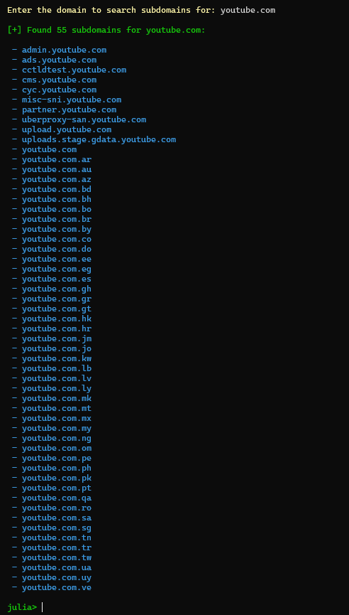

# JuliaScope - README

**JuliaScope** is a high-performance, multithreaded subdomain enumeration and reconnaissance utility crafted in Julia. This tool harnesses the power of parallel computing, high-speed data parsing, and intelligent subdomain discovery to support security researchers, red teamers, and penetration testers with robust and scalable recon capabilities.

---

## Core Features

### High-Throughput Parallelism
JuliaScope utilizes Julia’s native concurrency capabilities via `pmap` to perform asynchronous, distributed subdomain resolution across multiple domain permutations.

```julia
function get_subdomains(domain; max_workers=4)
    domains_to_search = [
        domain,
        "www.$domain",
        "mail.$domain",
        "api.$domain"
    ]

    chunk_size = max(1, ceil(Int, length(domains_to_search) / max_workers))
    chunks = [domains_to_search[i:min(i+chunk_size-1, end)] 
              for i in 1:chunk_size:length(domains_to_search)]

    results = pmap(fetch_subdomains_chunk, chunks)
    # ... combine results ...
end
```

### Expanded Domain Intelligence
Subdomain detection is augmented with intelligent permutations and crt.sh API integration. JuliaScope automatically targets conventional subdomains and parses Certificate Transparency logs to detect obscure endpoints.

Default domain list includes:
- `example.com`
- `www.example.com`
- `mail.example.com`
- `api.example.com`

### Optimized Data Structures
Results are stored in a `Set` to ensure deduplication and optimal memory usage during large-scale enumeration.

```julia
subdomains = Set()
push!(subdomains, "www.example.com")
```

### Fault-Tolerant Architecture
Resilient to network interruptions or HTTP errors via granular error handling inside processing chunks:

```julia
function fetch_subdomains_chunk(domain_chunk)
    local_results = Set()
    for domain in domain_chunk
        try
            # Perform lookup, parse response
        catch e
            continue  # Gracefully skip errored tasks
        end
    end
    return local_results
end
```

---

## Installation Guide

### Prerequisites
- [Julia 1.6+](https://julialang.org/downloads/)
- Internet access for external API queries

### Clone Repository
```sh
git clone https://github.com/yourusername/JuliaScope.git
cd JuliaScope
```

### Install Dependencies
```julia
using Pkg
Pkg.add(["HTTP", "JSON3", "Crayons", "ThreadsX"])
```

---

## Execution Instructions

1. **Launch Julia Runtime**
```sh
julia
```


2. **Navigate to Source Directory**
```julia
cd("path/to/JuliaScope")
```


3. **Load Main Script**
```julia
include("subdomain.jl")
```


4. **Initiate Scan**
```julia
subdomains = get_subdomains("example.com", max_workers=8)
```


Interactive output will display resolved subdomains in real time with colorized formatting (via `Crayons.jl`).

---

## Roadmap & Future Enhancements

- Fully self-contained CLI executable for Linux and Windows
- Integration with Shodan and SecurityTrails for passive recon
- Deep multithreading via `Threads.@spawn` and `ThreadsX`
- Enhanced subdomain mutation logic with fuzzing support

---

## Ethical Disclosure
JuliaScope is designed exclusively for lawful reconnaissance, security research, and authorized penetration testing engagements. Misuse of this tool for unauthorized scanning or intrusion is strictly prohibited and may violate legal statutes.

---

## Summary of Technical Improvements

- Concurrent subdomain scanning using Julia’s `pmap`
- Certificate Transparency data via crt.sh integration
- Robust fault-tolerant data acquisition
- Deduplication and low-overhead memory management
- Modular architecture for extensibility

---

## Contribution Guidelines

We welcome contributions that enhance capability, efficiency, or compatibility. To contribute:

- Fork the repository
- Submit a pull request with a descriptive commit message
- For significant proposals, open an issue for discussion first


---

## Author
made with love by moofin , no corporate fluff :3
